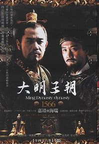

# 大明王朝1566
## 电视剧封面

<!--  -->

## 个人评价
历史剧巅峰，精品中的精品。一般的作品可能只是看完之后会刷一刷解说二创，几个月之后就不再记得了。大明王朝1566属于是不管看完之后多久，看到剧情切片都会再看一遍。

就剧情而言，大明王朝1566的两个剧情都是虚构的，但是虚构的剧情却能比任何真实的剧情都能揭露出历史的本质。

整体的氛围属于是黑暗、让人感到比较绝望的。
## 比较喜欢的b站视频
[“ 古 往 今 来 最 荒 唐 ”](https://www.bilibili.com/video/BV12w411K74q/?spm_id_from=333.337.search-card.all.click)

这个视频没什么内容，也谈不上制作多精良，只是视频切片+封面+标题+BGM营造出的氛围感很喜欢。

## 台词

再苦一苦百姓，骂名我来担。

独你一人是忠臣贤臣，良臣？ 我只是直臣。 无父无君的直臣？