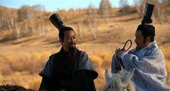
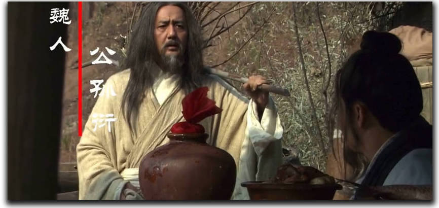
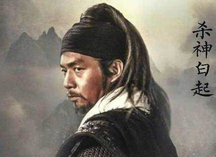

# 大秦帝国系列

大秦帝国理论上应该有四部，大秦帝国之裂变、纵横、崛起，大秦赋。但是大家都说大秦赋很差，所以我只看了裂变、纵横、崛起。

看大秦帝国的出发点是想要了解中国第一个大一统王朝秦一步一步走到统一的的“奋六世之余烈”的过程。
看完之后只能感慨，六世之余烈有多烈，二世而亡就有多可惜。

## 大秦帝国之裂变

有种史诗感，虽有美化，但是秦孝公和商鞅的情谊仍令我动容。

## 大秦帝国之纵横

人物刻画相较于裂变而言更加真实、复杂。最令我印象深刻的是：

秦惠文王嬴驷在大街上疯言：“车裂商鞅、赶走八子、杀甘龙”。

张仪离开秦国之后和公孙衍见面，二人回忆自己的一生，英雄迟暮，也算善终。

## 大秦帝国之崛起

逊色于裂变和纵横，但也算是不错的一部剧。

印象最深的是武安君白起的结局。

